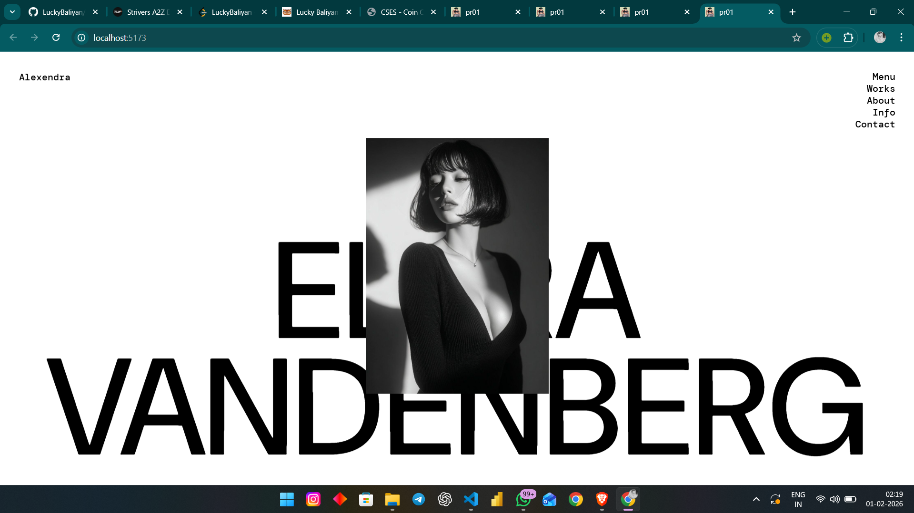
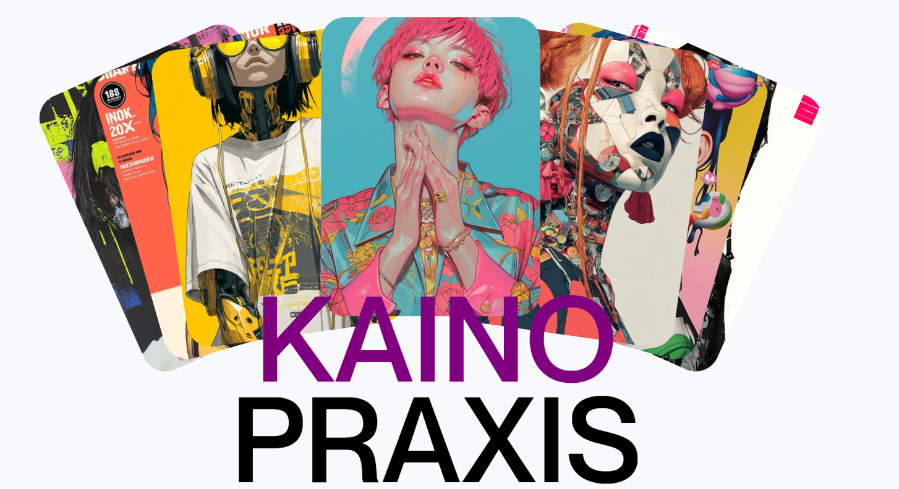

# 🎨 Animation Playground From Scratch to Smooth Motion

> A learning-focused animation repository featuring handcrafted effects built from scratch using modern frontend tools like React, GSAP, and Framer Motion.


---

## 🚀 About the Project

This repository is a **collection of animated effects built completely from scratch**, aimed at helping developers understand **how animations work internally**, not just how to use libraries.

All animations are:
- 🆓 Free to use  
- 🧠 Built for learning  
- 🛠️ Easy to tweak and experiment with  

---

## 📸 Preview

Here’s a visual preview of the animations included in this repository:




---

## ✨ What You’ll Find Here

- Custom animation effects built from scratch
- Scroll-based & timeline-driven animations
- React-based component animations
- Real-world animation techniques used in modern websites

---

## 🧩 Tech Stack & Concepts

### ⚙️ Core Technologies
- HTML5
- CSS3
- JavaScript (ES6+)

### ⚛️ Frameworks & Libraries
- React.js
- GSAP
- Framer Motion
- Locomotive Scroll
- Lenis

### 🧠 Concepts Covered
- Easing & motion curves  
- Scroll-triggered animations  
- Component-level motion design  
- Performance-optimized animations  

---

## 🌐 Live Demo

> 🚧 Live demo coming soon

## 📂 Project Structure

├── animations/
├── screenshots/
│ └── 1.png
├── index.html
└── README.md

## 🧪 How to Use

```bash
git clone https://github.com/your-username/your-repo-name.git

```


## Open the project and start experimenting 🚀

# 🎯 Who Is This For?

- Frontend Developers

- Motion Designers

- Students & learners

- Anyone curious about modern web animations

## ⭐ Support

If you like this project, don’t forget to give it a ⭐
It really helps 💙