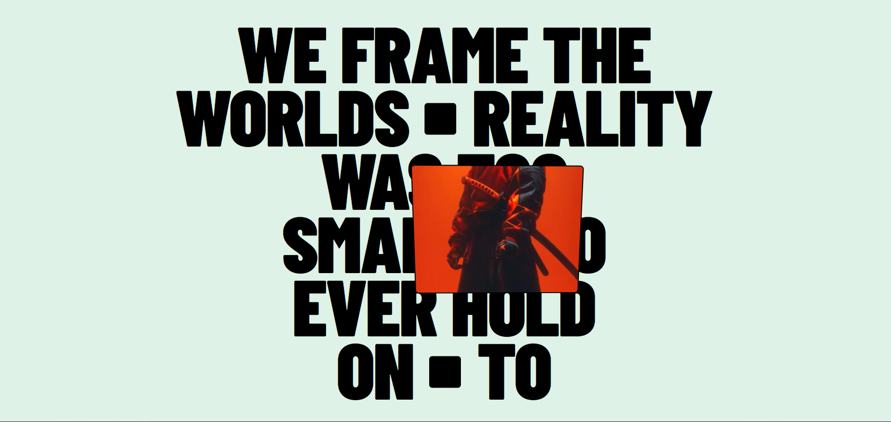

# ✨ Interactive Spot Card

A smooth interactive card animation built with **Vanilla JavaScript and GSAP**.

The interaction starts as a small dot and expands into a large image card when hovered. The card follows the cursor with subtle movement and 3D tilt, while the image moves in the opposite direction to create a **parallax effect**.

---

## 📸 Preview



> Replace `./screenshot.png` with the path to your screenshot.

---

## ✨ Features

- Smooth hover-to-expand animation
- Cursor-following card movement
- Dynamic 3D tilt based on cursor position
- Image parallax effect
- Smooth interpolation between target and current states
- Desktop-only interaction
- Automatic reset on mouse leave
- GSAP ticker-based animation loop

---

## 🛠️ Tech Stack

- HTML
- CSS
- JavaScript
- GSAP

---

## 🚀 Setup

```bash
npm install
npm run dev