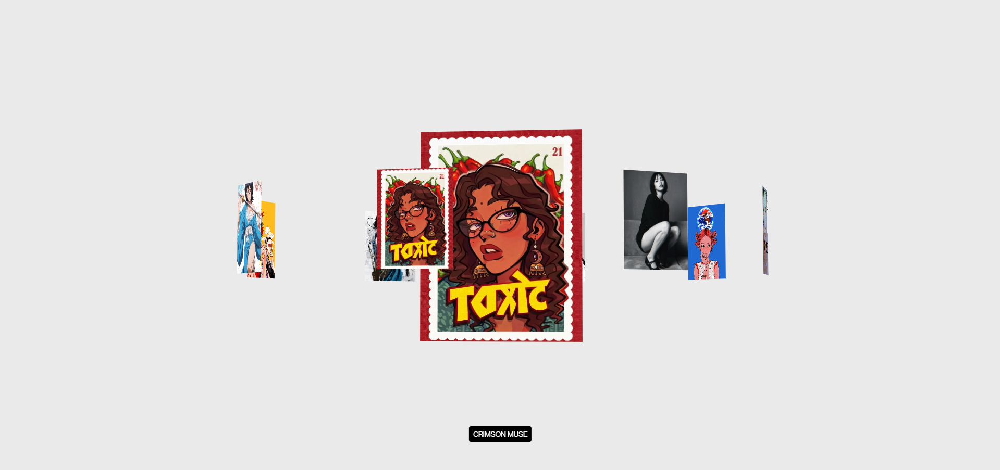

# 3D Rotating Carousel Animation Breakdown

An interactive 3D circular carousel built with **Vanilla HTML, CSS, JavaScript, and Vite**. This project demonstrates 3D CSS transforms, linear interpolation (Lerp) for smooth motion, continuous rendering with `requestAnimationFrame`, scroll sensitivity math, and interactive mouse parallax tilt.

---

## 📸 Preview



---

## ⚡ Quick Start

### 1. Install Dependencies
```bash
npm install
```

### 2. Run Development Server
```bash
npm run dev
```

---

## 🏗️ Project Architecture & Hierarchy

The DOM structure consists of a main wrapper (`.slider`), a transformed 3D container (`.stage`), an orbiting 3D ring (`.orbit`), a center preview box (`.preview`), and an active slide title label (`.title`).

```html
<main>
  <section class="slider">
    <div class="stage">
      <div class="orbit">
        <div class="preview"></div>
      </div>
    </div>
    <p class="title">Crimson Muse</p>
  </section>
</main>
```

---

## 🧠 Animation Breakdown & Mathematics

### 1. 3D Ring Layout & Trigonometric Orbit
The carousel positions 8 image panels evenly in a 360° circle along a 3D Z-axis radius.

* **Angular Spacing**: `angleBetweenSlides = 360° / totalSlides` (360° / 8 = 45°).
* **3D Positioning**: Each slide is rotated around the Y-axis by its specific angle (`slideIndex * 45°`), and then pushed outward along the Z-axis by `orbitRadius` (400px).

```javascript
const totalSlides = 8;
const orbitRadius = 400;
const angleBtweenSlides = 360 / totalSlides;

slideImages.forEach((imageSrc, slideNumber) => {
      const slide = document.createElement("div");
      slide.classList.add("panel");
      slide.innerHTML = ``;

      const angle = slideNumber * angleBtweenSlides;
      // Position slide in 3D space
      slide.style.transform = `rotateY(${angle}deg) translateZ(${orbitRadius}px)`;
      orbit.appendChild(slide);
});
```

---

### 2. Scroll Wheel Sensitivity & Target Rotation
When the user scrolls the mouse wheel, we intercept the `deltaY` value and convert it into target rotation degrees (`targetRotation`).

```javascript
window.addEventListener("wheel", (e) => {
      // 0.28 acts as scroll sensitivity
      // Multiplier limits delta value into a smooth degree range
      targetRotation -= e.deltaY * 0.28; 
}, { passive: true });
```
* **Scroll Sensitivity**: A factor of `0.28` scales mouse delta values into manageable rotation increments. Higher values speed up rotation.
* **Direction**: Subtracting `e.deltaY * 0.28` makes scrolling down rotate the carousel forward. Changing `-=` to `+=` reverses the rotation.

---

### 3. Smooth Physics with Linear Interpolation (Lerp)
Directly applying target values to transforms creates choppy, instant jumps. **Linear Interpolation (Lerp)** smoothly transitions current values towards target values over time.

$$\text{lerp}(a, b, t) = a + (b - a) \times t$$

```javascript
const lerp = (from, to, amount) => from + (to - from) * amount;
const smoothing = 0.05;

// In the animation loop:
currentRotation = lerp(currentRotation, targetRotation, smoothing);
```
* `smoothing = 0.05` ensures smooth, physics-based decay and deceleration during rotation and tilt movement.

---

### 4. Active Slide Index & Negative Modulo Logic
To display the current active slide title and central preview image based on `currentRotation`, we compute the current step:

```javascript
function showActiveSlide() {
      // Convert degree rotation into slide index step
      const steps = Math.floor(-currentRotation / angleBtweenSlides);

      // Handle JavaScript negative modulo quirk:
      // In JS, -1 % 8 returns -1. Adding totalSlides before modulo ensures positive range [0, 7].
      const activeIndex = ((steps % totalSlides) + totalSlides) % totalSlides;

      // DOM Optimization: Only update preview and title when step changes
      if (shownIndex !== activeIndex) {
            shownIndex = activeIndex;
            previewImg.src = slideImages[activeIndex];
            titleTag.innerText = slideTitles[activeIndex];
      }
}
```
* **DOM Update Guard**: Wrapping state changes inside `if (shownIndex !== activeIndex)` prevents expensive DOM manipulation on every single frame during the 60FPS loop.

---

### 5. Interactive 3D Mouse Parallax Tilt
Moving the mouse over the `.slider` container introduces a 3D tilt effect on the entire `.stage`.

```javascript
const maxTilt = 30;

slider.addEventListener("mousemove", (e) => {
      // Normalize cursor distance from screen center (-0.5 to +0.5)
      const distanceFromCenterX = e.clientX / window.innerWidth - 0.5;
      const distanceFromCenterY = e.clientY / window.innerHeight - 0.5;

      // Calculate tilt angles based on mouse offset
      targetTiltY = distanceFromCenterX * maxTilt;
      targetTiltX = -distanceFromCenterY * maxTilt;
});

// Reset tilt on mouse leave
slider.addEventListener("mouseleave", () => {
      targetTiltX = 0;
      targetTiltY = 0;
});

function updateTilt() {
      currentTiltX = lerp(currentTiltX, targetTiltX, smoothing);
      currentTiltY = lerp(currentTiltY, targetTiltY, smoothing);

      // Apply smoothed 3D rotation to the stage container
      stage.style.transform = `rotateX(${-currentTiltX}deg) rotateY(${-currentTiltY}deg)`;
}
```

---

### 6. Continuous 60FPS Render Loop (`requestAnimationFrame`)
`requestAnimationFrame` schedules screen repaints synced with the display refresh rate (~60Hz / 120Hz).

```javascript
function animate() {
      // Smoothly update ring rotation
      currentRotation = lerp(currentRotation, targetRotation, smoothing);
      orbit.style.transform = `translate(-50%, -50%) rotateY(${currentRotation}deg)`;

      // Counter-rotate preview box so center content remains upright & facing front
      previewBox.style.transform = `translate(-50%, -50%) rotateY(${-currentRotation}deg)`;

      // Check active slide and apply mouse tilt
      showActiveSlide();
      updateTilt();

      // Request next frame repaint
      requestAnimationFrame(animate);
}

// Initialize loop
animate();
```
* **Counter-Rotation**: The preview box is rotated by `-currentRotation` to perfectly counteract the orbit's `rotateY(currentRotation)`, keeping the central image always facing the viewer.
* **Web API Execution**: Unlike `setInterval` or infinite recursion, `requestAnimationFrame` queues frame callbacks in the browser's native render pipeline, saving CPU/GPU cycles when the tab is inactive.

---

## 📁 File Structure

```
RotatingCarousal/
├── index.html              # HTML structure & stage elements
├── package.json            # Vite scripts & configuration
├── Readme.md               # Animation documentation & code breakdown
├── public/                 # Carousel image assets (1.webp - 8.webp)
├── screenshot/             # Documentation preview image (1.png)
└── src/
    ├── scripts/
    │   └── main.js         # Core 3D carousel logic & render loop
    └── styles/
        └── main.css        # 3D perspective & component styling
```
